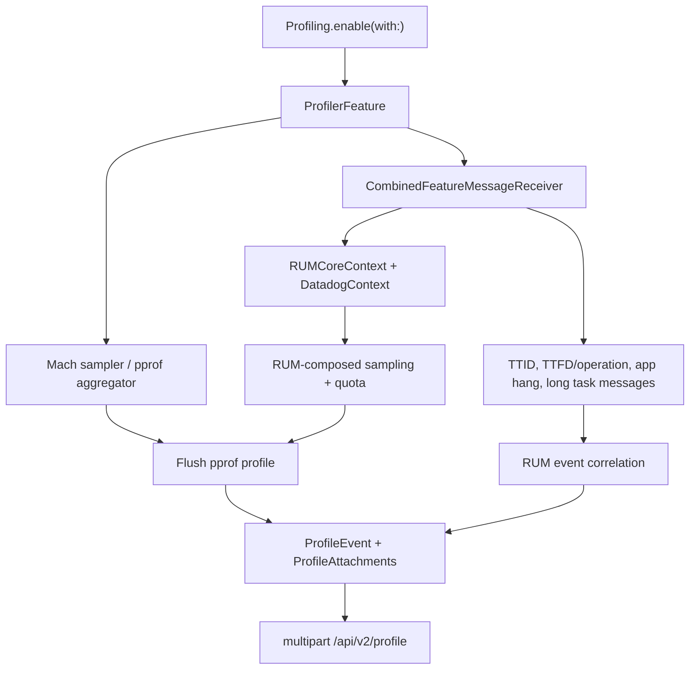

# Profiling Feature

## Overview

Profiling captures pprof wall-time samples from Apple application processes and correlates them with RUM context. It supports three profiling paths:

- **Application launch profiling**: captures process startup and writes the launch profile when RUM emits the TTID app-launch vital.
- **Continuous Profiling**: periodically records profiles for sampled-in RUM sessions and links long tasks and app hangs.
- **Custom Profiling**: starts around sampled RUM operations created with `ProfilingOptions`.

Profiling requires `Datadog.initialize()` before `Profiling.enable()`. RUM is not a compile-time module dependency, but the feature depends on RUM context and RUM payload messages for session-linked sampling, quota checks, and profile correlation.

**Platform**: iOS, tvOS, visionOS. The Swift sources and Mach profiler are compiled out on watchOS with `#if !os(watchOS)`.

**API status**: `Profiling.enable(with:in:)` is experimental. RUM operation APIs used for custom profiling are in preview.

## Quick Start Example

```swift
import Foundation
import DatadogCore
import DatadogRUM
import DatadogProfiling

// 1. Initialize Core SDK first
Datadog.initialize(
    with: Datadog.Configuration(
        clientToken: "<client_token>",
        env: "<environment>"
    ),
    trackingConsent: .granted
)

// 2. Enable RUM so Profiling can receive session context and operation/vital messages
RUM.enable(
    with: RUM.Configuration(
        applicationID: "<rum_application_id>",
        uiKitViewsPredicate: DefaultUIKitRUMViewsPredicate(),
        uiKitActionsPredicate: DefaultUIKitRUMActionsPredicate(),

        // Continuous Profiling can attach app hangs and long tasks to profiles
        // when these RUM performance features are enabled.
        // longTaskThreshold default: 0.1 seconds
        longTaskThreshold: 0.1,
        // appHangThreshold default: nil (disabled)
        appHangThreshold: 2.0
    )
)

// 3. Enable Profiling
Profiling.enable(
    with: Profiling.Configuration(
        // Custom intake endpoint for profile uploads.
        // Default: nil (uses Datadog intake at /api/v2/profile)
        customEndpoint: nil,

        // Application launch profiling sample rate.
        // 100 = all launches profiled, 0 = none profiled.
        // Applies to the next process launch.
        // Default: 5.0
        applicationLaunchSampleRate: 5.0,

        // Continuous Profiling sample rate, composed with the RUM session sampler.
        // 100 = all sampled-in RUM sessions eligible, 0 = continuous profiling disabled.
        // Default: 5.0
        continuousSampleRate: 5.0
    )
)

let monitor = RUMMonitor.shared()

// 4. (Optional) Report TTFD so continuous profiles can correlate with full-display timing
monitor.reportAppFullyDisplayed()

// 5. (Optional) Custom Profiling around a RUM operation
monitor.startOperation(
    name: "checkout_flow",
    operationKey: "cart-123",
    attributes: ["screen": "checkout"],
    options: ProfilingOptions(sampleRate: 100.0)
)

// Work being profiled...

monitor.succeedOperation(
    name: "checkout_flow",
    operationKey: "cart-123",
    attributes: ["result": "success"]
)
```

## Architecture Overview

Profiling is a `DatadogRemoteFeature` named `profiler`. `Profiling.enable(with:in:)` registers `ProfilerFeature`, which builds a request builder, session sampler provider, quota checker, app-launch profiler, and the main `DatadogProfiler` message receiver.

The low-level sampler lives in `DatadogProfiling/Mach`. It samples application threads with Mach APIs, aggregates stack traces into a pprof profile, and exposes the native profiler to Swift through a C interface.

`ProfilerFeature` writes UserDefaults keys consumed by the native auto-start path for app-launch profiling. The Swift side then decides when to keep the native profiler running, when to flush profiles, and whether to write or drop a profile.



`ProfilingContext` is published into core context so RUM events can include whether profiling is running, stopped, or in an error state.

## Key Files

### Feature Entry Point
- **`DatadogProfiling/Sources/Profiling.swift`** - Main entry point. Call `Profiling.enable(with:in:)` to register the feature with core.

### Configuration
- **`DatadogProfiling/Sources/ProfilingConfiguration.swift`** - Customer-facing configuration: `customEndpoint`, `applicationLaunchSampleRate`, and `continuousSampleRate`.

### Runtime Orchestration
- **`DatadogProfiling/Sources/ProfilerFeature.swift`** - Internal feature composition. Registers message receivers, configures app-launch UserDefaults, creates samplers and quota checks.
- **`DatadogProfiling/Sources/AppLaunchProfiler.swift`** - Handles app-launch profiles and flushes them when TTID arrives.
- **`DatadogProfiling/Sources/DatadogProfiler.swift`** - Main Continuous and Custom Profiling state machine. Starts/stops native profiling, handles RUM operation/app hang/long task messages, and flushes profiles.
- **`DatadogProfiling/Sources/ProfilingSamplerProvider.swift`** - Stores continuous profiling configuration and session-linked sampling decisions.
- **`DatadogProfiling/Sources/ProfilingQuotaChecker.swift`** - Checks session-scoped profiling quota admission.
- **`DatadogProfiling/Sources/Models/ProfilingConditions.swift`** - Blocks profiling in low battery, Low Power Mode, or background conditions.

### Event Writing and Upload
- **`DatadogProfiling/Sources/ProfilingHandler.swift`** - Shared write path for app-launch, continuous, and custom profiles. Serializes pprof data and RUM events into a profile event.
- **`DatadogProfiling/Sources/RequestBuilder.swift`** - Builds the multipart upload to `/api/v2/profile`.
- **`DatadogProfiling/Sources/ProfileEvent.swift`** - JSON event metadata for a profile.
- **`DatadogProfiling/Sources/Models/ProfileAttachments.swift`** - pprof and RUM event attachments.

### Native Profiler
- **`DatadogProfiling/Mach/`** - Native Mach sampler and pprof aggregation layer exposed to Swift through `dd_profiler.h` and `dd_pprof.h`.

## Configuration Categories

### Upload
- **`customEndpoint`**: Optional replacement URL for profile uploads. Default: `nil`, which uses the Datadog site endpoint plus `/api/v2/profile`.

### Sampling
- **Application launch**: `applicationLaunchSampleRate` default is `5.0`. The value is stored in the profiling UserDefaults suite for the native app-launch path and takes effect on the next process launch. If multiple SDK instances set it, the native side uses the lowest sample rate.
- **Continuous Profiling**: `continuousSampleRate` default is `5.0`. A value above zero configures continuous profiling. The final decision is composed with the current RUM session sampler via `RUMCoreContext.sessionSampler.combined(with: continuousSampleRate)`.
- **Custom Profiling**: Pass `ProfilingOptions(sampleRate:)` to `RUMMonitor.shared().startOperation(...)`. RUM composes this operation sample rate with the session sampler before sending operation messages to Profiling. Operation-based custom profiling controls the profiling window only when Continuous Profiling is disabled or sampled out; otherwise sampled operation steps are attached to the continuous profile.

### Runtime Conditions
Profiling is suspended when `ProfilingConditions` sees any blocker:
- Battery is below 10% and not charging.
- Low Power Mode is enabled.
- The app is in the background.

Continuous profiles are also flushed when the app backgrounds after foreground activity. Custom profiling keeps the native profiler alive while sampled operations are ongoing.

### Quota
`ProfilingQuotaChecker` checks whether the active RUM session is allowed to write profiles after Profiling has RUM session context and granted consent. Temporary quota lookup failures do not block profiling, while explicit quota rejection stops profiling for that session. A new RUM session triggers a fresh quota decision.

### Upload Format
Profile uploads are multipart/form-data requests that include profile metadata, serialized pprof data, and correlated RUM events when present.

## Common Troubleshooting Patterns

### "No profiles appear"
1. Verify `Datadog.initialize()` and `Profiling.enable()` were called.
2. Verify RUM is enabled and tracking consent is `.granted`; Profiling relies on RUM context for session-linked sampling and quota.
3. Check `applicationLaunchSampleRate`, `continuousSampleRate`, or operation `ProfilingOptions(sampleRate:)` are greater than zero.
4. Confirm the app is not on watchOS, in Low Power Mode, below the battery threshold, or running only in background.
5. Ensure the session was not rejected by the profiling quota API.

### "Continuous profiles are not written even though profiling runs"
1. Continuous profiles are written only when the RUM session samples continuous profiling in.
2. A continuous profile needs correlated RUM data currently collected by Profiling: RUM vitals such as TTFD or sampled operation steps, app hangs, or long tasks.
3. Report TTFD with `monitor.reportAppFullyDisplayed()`, use sampled RUM operation steps, or enable RUM long tasks (`longTaskThreshold`) and app hangs (`appHangThreshold`) if those correlations are expected.

### "Custom operation profiles are missing"
1. Use `startOperation(name:operationKey:attributes:options:)` with `ProfilingOptions(sampleRate:)`. Deprecated `startFeatureOperation` does not accept profiling options.
2. Use matching `name` and `operationKey` in `succeedOperation` or `failOperation`.
3. Keep the operation active long enough for the native profiler to collect useful samples.
4. Remember that the operation sample rate is composed with the RUM session sampler.
5. Operation-based custom profiling takes over only when Continuous Profiling is disabled or sampled out. If Continuous Profiling is sampled in, sampled operation steps are attached to the continuous profile instead of creating a separate custom profile.

### "App launch profile is missing"
1. Ensure RUM is enabled early enough to emit the TTID message consumed by `AppLaunchProfiler`.
2. Do not rely on `monitor.reportAppFullyDisplayed()` to emit TTID. It reports TTFD, which is delivered as a vital/operation message for continuous profile correlation.
3. Verify `applicationLaunchSampleRate` is greater than zero.
4. Remember that app-launch profiling settings are read at library load, before `Profiling.enable()` runs. Enabling profiling or changing `applicationLaunchSampleRate` affects the next process launch, not the current launch.
5. App launch profiling may stop with `prewarmed` status when iOS app prewarming is detected.

### "Profiles stop when the app backgrounds"
This is expected. Background state is a profiling blocker, and the profiler flushes current data when the app transitions to background after foreground activity.

## Feature Interactions

- **RUM**: Profiling reads RUM context and RUM payload messages for session-linked sampling, quota checks, and profile correlation.

## Additional Context

- Only one `DatadogProfiler` instance can be active in a process. The initializer returns `nil` if another instance is already active.
- Profiling can stop when runtime conditions block sampling and restart when conditions become valid again, such as after the app returns to foreground.
- Profile uploads include pprof data, correlated RUM events, and profile metadata.
