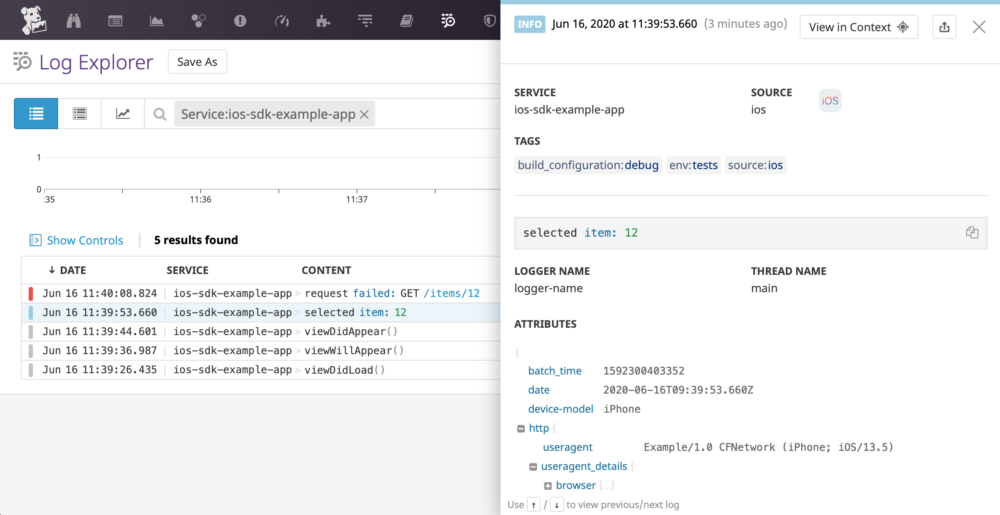

# Datadog SDK for iOS

> Swift and Objective-C libraries to interact with Datadog on iOS.

## Getting Started

### Log Collection

See the dedicated [Datadog iOS Log Collection](https://docs.datadoghq.com/logs/log_collection/ios/?tab=us) documentation to learn how to send logs from your iOS application to Datadog.

### Trace Collection

See [Datadog iOS Trace Collection](https://docs.datadoghq.com/tracing/setup/ios/?tab=us) documentation to try it out.

## Contributing

Pull requests are welcome. First, open an issue to discuss what you would like to change. For more information, read the [Contributing Guide](CONTRIBUTING.md).

## License

[Apache License, v2.0](LICENSE)
