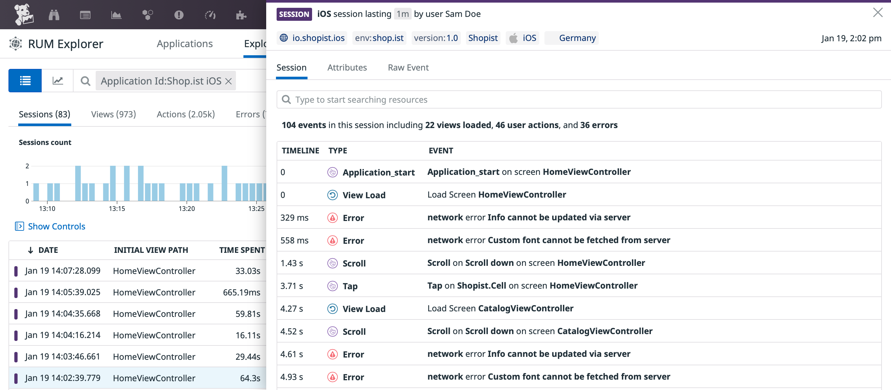

    
    
    
    

# Datadog SDK for iOS and tvOS

> Swift and Objective-C libraries to interact with Datadog on iOS and tvOS.

## Getting Started

### Log Collection

See the dedicated [Datadog iOS Log Collection](https://docs.datadoghq.com/logs/log_collection/ios) documentation to learn how to send logs from your iOS application to Datadog.

### Trace Collection

See [Datadog iOS Trace Collection](https://docs.datadoghq.com/tracing/setup_overview/setup/ios) documentation to try it out.

### RUM Events Collection

See [Datadog iOS RUM Collection](https://docs.datadoghq.com/real_user_monitoring/ios) documentation to try it out.

## Integrations

### Alamofire

If you use [Alamofire](https://github.com/Alamofire/Alamofire), review the [`Datadog Alamofire Extension` library](DatadogExtensions/Alamofire/) to learn how to automatically instrument requests with the Datadog iOS SDK.

## Contributing

Pull requests are welcome. First, open an issue to discuss what you would like to change. For more information, read the [Contributing Guide](CONTRIBUTING.md).

## License

[Apache License, v2.0](LICENSE)
