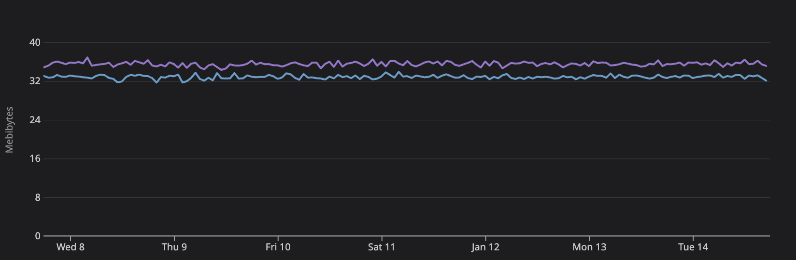
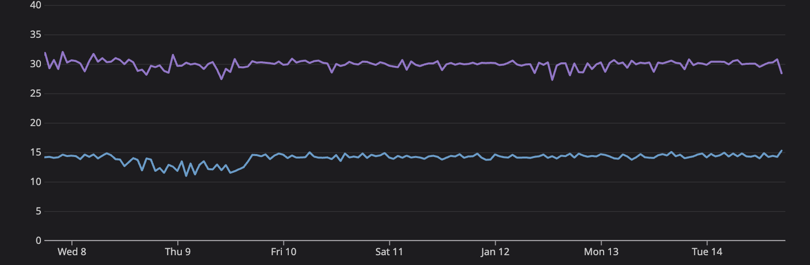

# Session Replay Performances

# Methodology

The following measures were collected by a [Benchmark Application](https://github.com/DataDog/dd-sdk-ios/tree/develop/BenchmarkTests) with Datadog iOS SDK ([d41d5dd](https://github.com/DataDog/dd-sdk-ios/commit/d41d5dd2a14c1533f1384b4a9d22801c68abad71)) running in [Datadog Synthetic Testing for Mobile Application](https://docs.datadoghq.com/synthetics/mobile_app_testing/) environment.

Each scenario execute **Baseline** and **Instrumented** runs: Baseline runs without the Datadog SDK initialized while **Instrumented** runs with RUM and Session Replay enabled.
The **Overhead** metrics are computed by comparing the Baseline with Instrumented values.

# UIKit Catalog Scenario

The scenario goes through the [UIKit Catalog](https://developer.apple.com/documentation/uikit/views_and_controls/uikit_catalog_creating_and_customizing_views_and_controls) during approximately 5m 30s at each run.

The applied [configuration](https://github.com/DataDog/dd-sdk-ios/blob/d41d5dd2a14c1533f1384b4a9d22801c68abad71/BenchmarkTests/Runner/Scenarios/SessionReplay/SessionReplayScenario.swift#L23-L45) sets permissive masking.

## Synthetic Tests Runs

## Memory Usage

## Memory Overhead

## CPU Load

## CPU Overhead

# SwiftUI Catalog Scenario

The scenario goes through the [SwiftUI Catalog](https://github.com/barbaramartina/swiftuicatalog) during approximately 4m 45s at each run.

The applied [configuration](https://github.com/DataDog/dd-sdk-ios/blob/d41d5dd2a14c1533f1384b4a9d22801c68abad71/BenchmarkTests/Runner/Scenarios/SessionReplay/SessionReplaySwiftUIScenario.swift#L23-L44) sets permissive masking.

## Synthetic Tests Runs

## Memory Usage

## Memory Overhead

> We see no significant memory overhead when recording SwiftUI.

## CPU Load

## CPU Overhead

